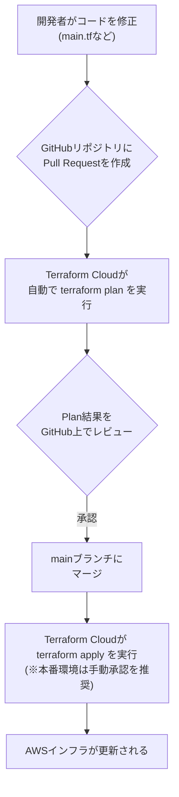

# Terraformによるインフラ構成管理 設計書

## 1. はじめに

### 1.1. 本書の目的

本書は、AWSインフラストラクチャを、TerraformおよびTerraform Cloudを用いてコードとして管理（Infrastructure as Code: IaC）するための設計方針と運用ルールを定めることを目的とします。

IaCを導入することにより、以下の実現を目指します。

*   **再現性の確保:** 誰が実行しても同じ構成のインフラを構築できる。
*   **構成の可視化:** インフラ構成をコードで表現し、Gitでバージョン管理・レビューを行う。
*   **運用の自動化:** 手作業によるヒューマンエラーを削減し、迅速なデプロイを実現する。
*   **セキュリティの向上:** 機密情報をコードから分離し、安全に管理する。

### 1.2. 対象範囲

本書は、以下のAWS環境の構築と管理を対象とします。

*   **AWS Organizations 管理基盤**
*   （将来的な拡張として）開発 (dev) 環境、本番 (prd) 環境

### 1.3. 関連ドキュメント

本書は「【AWS組織管理】要件定義書.md」で定義された要件を実現するための、具体的な技術設計を定めるものです。

## 2. 全体構成

### 2.1. ツールスタック

本プロジェクトで利用する主要なツールは以下の通りです。

| ツール | バージョン/備考 | 役割 |
| :--- | :--- | :--- |
| **Terraform** | v1.5.0 以上 | IaCを実現するためのコアツール。インフラの構成をコードで定義する。 |
| **Terraform Cloud**| Free Tier | Terraformの状態（State）管理、リモート実行、変数管理を行うSaaS。|
| **AWS** | - | インフラストラクチャを提供するクラウドプラットフォーム。 |
| **GitHub** | - | Terraformコードを管理するバージョン管理システム（VCS）。 |

### 2.2. 実行フロー (VCS-driven Workflow)

インフラの変更は、Terraform CloudとGitHubを連携させた**VCS-driven Workflow**に沿って行う。



### 2.3. AWSへの認証方式 (OIDC連携)

要件定義書のセキュリティ要件に基づき、静的なアクセスキーは使用せず、Terraform CloudとAWS IAMの**OIDC連携**による動的な認証を採用する。

この方式により、有効期間の短い一時的な認証情報が利用されるため、セキュリティが大幅に向上する。

**【認証フロー概要】**
1.  **AWS IAM:** Terraform Cloudを信頼するIDプロバイダとして登録し、Terraform実行用のIAMロールを作成する。
2.  **Terraform Cloud:** 実行時にAWSにOIDCトークンを提示し、作成したIAMロールを引き受ける(AssumeRole)。
3.  **AWS STS:** トークンを検証し、Terraformの実行に必要な一時的な認証情報を払い出す。

この設定はTerraform CloudとAWSのコンソールで行い、認証情報そのものをコードや変数で管理する必要はない。

## 3. Terraform コード設計

### 3.1. ファイル構成

コードの保守性と可読性を高めるため、以下の標準的なファイル構成に従います。

```
.
├── main.tf              # 主要なリソース定義
├── variables.tf         # 入力変数の定義
├── outputs.tf           # 出力値の定義
├── versions.tf          # Terraform/プロバイダーのバージョン指定
├── backend.tf           # バックエンド設定
├── .gitignore           # Git管理対象外ファイルの設定
└── ...                  # サービスや機能単位でファイルを追加
```

*   **`terraform.tfvars`ファイルは使用しない。** 変数はすべてTerraform CloudのUI上で管理。
*   SCPポリシーなどの長いJSONは、可読性のため別ファイル（例: `policies/*.json`）に分割し、`file()`関数で読み込む。
*   

## 4. Terraform Cloud 運用設計

### 4.1. ワークスペース戦略

**1State = 1ワークスペース** の原則に従い、状態を管理したい単位でワークスペースを作成する。

| ワークスペース名 | 対象 | Gitブランチ | 自動Apply |
| :--- | :--- | :--- | :--- |
| **`aws-organizations-management`** | AWS Organizations 管理基盤 | `main` | **有効** (手動確認ステップを挟むことを推奨) |

### 4.2. 変数管理

環境ごとの差異や機密情報は、Terraform Cloudの**Workspace Variables**で管理。

#### 4.2.1. Terraform Variables

Terraformコード (`.tf`ファイル) から参照される通常の変数。

| 変数名 | 値 (例) | 説明 |
| :--- | :--- | :--- |
| `budget_amount`| `"10"` | コスト監視の予算額 (USD) |

#### 4.2.2. Environment Variables (機密情報)

Terraformの実行環境に渡される環境変数を設定します。
**※AWS認証情報は、2.3で定めるOIDC連携によって動的に払い出されるため、ここでは設定しない。**

| 変数名 | 設定値 | Sensitive |
| :--- | :--- | :--- |
| `TF_VAR_admin_email` | (Terraform Cloud UI上で設定) | **有効** |

## 5. 運用ルール

*   **インフラの変更は、原則Terraform経由で行う。** 手動での変更は禁止する。
*   **機密情報は、絶対にGitリポジトリにコミットしない。** `variables.tf`には`default`値を設定せず、Terraform Cloud上で管理する。
*   **`terraform apply`は、ローカル環境から実行しない。** 必ずTerraform Cloud上のワークスペースを通じて実行する。

## 6. 非機能要件への対応方針

本書で定める設計は、「【AWS組織管理】要件定義書」の非機能要件を以下の通り実現する。

| 非機能要件項目 | 対応する設計・運用ルール |
| :--- | :--- |
| **状態ファイルの保護** | Terraform Cloudをバックエンドとして利用し、Stateファイルを暗号化してリモートで一元管理する。ローカルでのStateファイル保持は禁止する。（ルール5、設計4.1） |
| **機密情報の管理** | `admin_email`等の機密情報はTerraform CloudのSensitive変数で管理しコードから分離する。AWS認証は**OIDC連携**によって実現し、静的なアクセスキーを完全に排除する。（設計2.3, 4.2.2, ルール5） |
| **構成管理の信頼性** | 全てのインフラ変更はGitHubへのPull Requestを起点とするVCS-driven Workflowで行う。`main`ブランチへのマージにはレビューと`terraform plan`の成功を必須とする。（設計2.2） |
| **監査証跡の確保** | 「誰が、いつ、何を」変更したかは、GitHubのコミットログとTerraform Cloudの実行履歴によって恒久的に記録・追跡が可能である。（設計2.2） |
| **テスト容易性** | Pull Request作成時に`terraform plan`が自動実行され、変更の影響範囲を適用前にレビューできる。（設計2.2） |

```