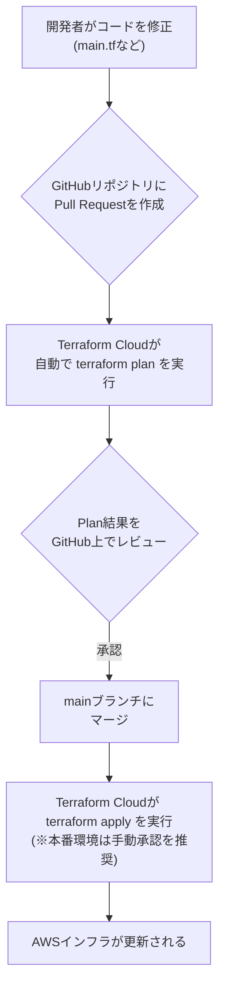

# AWS Organizations 組織管理システム 基本設計書

## 目次

- [1. 概要](#1-概要)
- [2. システム構成](#2-システム構成)
  - [2.1. システム構成図](#21-システム構成図)
  - [2.2. 利用技術・サービス](#22-利用技術・サービス)
  - [2.3. 管理ワークフロー (VCS-driven Workflow)](#23-管理ワークフロー-vcs-driven-workflow)
  - [2.4. 認証方式 (OIDC連携)](#24-認証方式-oidc連携)
- [3. 機能設計](#3-機能設計)
  - [3.1. メンバーアカウントのプロビジョニング機能 (F-ORG-001)](#31-メンバーアカウントのプロビジョニング機能-f-org-001)
  - [3.2. 予防的ガードレール機能 (SCP) (F-ORG-002)](#32-予防的ガードレール機能-scp-f-org-002)
  - [3.3. 発見的ガードレール機能 (F-ORG-003)](#33-発見的ガードレール機能-f-org-003)
  - [3.4. コスト監視・通知機能 (F-ORG-004)](#34-コスト監視・通知機能-f-org-004)
  - [3.5. シングルサインオン (SSO) 機能 (F-ORG-005)](#35-シングルサインオン-sso-機能-f-org-005)
- [4. データ設計](#4-データ設計)
  - [4.1. 構成管理データ (Terraform)](#41-構成管理データ-terraform)
  - [4.2. 監査ログデータ設計](#42-監査ログデータ設計)
- [5. 非機能要件設計](#5-非機能要件設計)
- [6. 命名規約](#6-命名規約)
  - [6.1. AWSリソース命名規約](#61-awsリソース命名規約)

## 1. 概要

本ドキュメントは、「【AWS組織管理】要件定義書.md」に基づき、システムの実現方式を定義する基本設計書です。本設計書は、後続の工程である詳細設計および実装のインプットとなることを目的とします。

## 2. システム構成

### 2.1. システム構成図

`【AWS組織管理】システム構成図.drawio`を参照

### 2.2. 利用技術・サービス

| 分類 | 技術・サービス名 | 目的 |
| :--- | :--- | :--- |
| **クラウド** | Amazon Web Services (AWS) | インフラ基盤 |
| **IaC** | Terraform (v1.5.0以上) | AWSリソースのコードによる宣言的な管理 |
| **IaC管理** | Terraform Cloud (Free Tier) | State管理、リモート実行、変数管理 |
| **組織・アカウント管理** | AWS Organizations | 複数AWSアカウントの一元管理、OU・SCPの適用 |
| **認証・アクセス管理** | AWS IAM Identity Center | 複数AWSアカウントへのシングルサインオン(SSO)の提供 |
| **コスト管理** | AWS Budgets | 予算設定と超過アラート通知 |
| **監視・ログ** | AWS CloudTrail | 全アカウントのAPI操作ログの収集と監査 |
| **セキュリティ監視** | AWS IAM Access Analyzer | 外部公開されたリソースの継続的な検知 |
| | AWS Trusted Advisor | AWSベストプラクティスからの逸脱を検知 |
| **通知** | Amazon Simple Notification Service (SNS) | 各種アラート（コスト、セキュリティ）の管理者への通知 |
| **ストレージ** | Amazon S3 | CloudTrailログ等の保管 |
| **バージョン管理** | Git (GitHub) | Terraform構成コードのバージョン管理と変更履歴の記録 |

### 2.3. 管理ワークフロー (VCS-driven Workflow)

インフラの変更は、Terraform CloudとGitHubを連携させた**VCS-driven Workflow**に沿って行います。

### 2.4. 認証方式 (OIDC連携)

セキュリティ向上のため、静的なアクセスキーは使用せず、Terraform CloudとAWS IAM of **OIDC連携**による動的な認証を採用します。

1. **AWS IAM:** Terraform Cloudを信頼するIDプロバイダとして登録し、Terraform実行用のIAMロールを作成する。
2. **Terraform Cloud:** 実行時にAWSにOIDCトークンを提示し、作成したIAMロールをAssumeRoleする。
3. **AWS STS:** トークンを検証し、一時的な認証情報を払い出す。

## 3. 機能設計

### 3.1. メンバーアカウントのプロビジョニング機能 (F-ORG-001)

- **処理概要:** Terraformを用いて、標準化された設定を持つ新規AWSアカウントを払い出す。
- **トリガー:** 管理者によるGitリポジトリへの構成変更のPush、およびPull Requestに対する`terraform apply`の実行。
- **入力:** Terraform構成ファイル（`.tf`）に記述されたアカウント情報（アカウント名、メールアドレス、所属OUなど）。
- **処理シーケンス:**
    1. 管理者が、新規アカウントの定義をTerraform構成ファイル（例: `accounts.tf`）に追加する。
    2. 定義には、アカウント名、ルートユーザーのメールアドレス、および所属させるOU（Organizational Unit）を指定する。
    3. 変更をGitにプッシュし、プルリクエストを作成してレビューを受ける。
    4. 承認後、Terraform Cloudが自動的に`terraform apply`を実行する。
    5. TerraformがAWS Organizations APIを呼び出し、新しいメンバーアカウントを作成し、指定されたOUに配置する。
- **出力:** 指定したOUに配置され、ガードレールが適用された状態のAWSアカウント。
- **エラー処理:** `terraform plan`の結果をレビューし、意図しない変更が含まれていないか事前に確認する。apply失敗時は、Terraform Cloudがエラーを通知し、CloudTrailログ等で原因を調査する。

### 3.2. 予防的ガードレール機能 (SCP) (F-ORG-002)

- **処理概要:** Terraformで定義されたサービスコントロールポリシー（SCP）を、組織のルートまたは特定のOUにアタッチし、セキュリティポリシーを強制する。
- **トリガー:** Terraformによる構成変更の適用。
- **入力:** Terraform構成ファイル（`.tf`）にJSON形式で定義されたSCPの内容。
- **処理シーケンス:**
    1. 管理者がTerraform構成ファイルにSCPポリシーを定義する (`aws_organizations_policy`)。
        - **リージョン制限:** `aws:RequestedRegion`条件キーを使用し、許可されたリージョン（ap-northeast-1等）以外の各アクションをDenyする。
        - **特権操作制限:** ルートユーザーからの特定のアクションをDenyする設定等。
        - **セキュリティ設定保護:** IAMロールの削除等を特定のロールに制限する設定。
    2. 定義したSCPを対象のOUまたは組織ルートにアタッチする (`aws_organizations_policy_attachment`)。
    3. Gitワークフロー経由で`terraform apply`を実行し、SCPを適用する。
- **出力:** ポリシーに違反するAPIリクエストに対するAWSからの拒否（Deny）応答。
- **エラー処理:** 適用前に`terraform plan`で影響範囲を確認する。意図しない拒否が発生した場合は、CloudTrailログで原因となるSCPを特定する。

### 3.3. 発見的ガードレール機能 (F-ORG-003)

- **処理概要:** AWS IAM Access AnalyzerとAWS Trusted Advisorを組織レベルで有効化し、リスクや逸脱を継続的に監視・通知する。
- **トリガー:** 各AWSサービスによる継続的な自動スキャン、および定期的なチェック。
- **入力:** 各メンバーアカウントのリソース構成情報。
- **処理シーケンス:**
    1. **IAM Access Analyzer:**
        - Terraformを用いて、管理アカウントで組織の委任管理者として設定し、組織レベルのAnalyzerを有効化する。
        - 意図しない外部アクセスを許可するリソースを検知すると、Findingを生成する。
        - EventBridgeルールでSNS通知を行い、管理者へメール送信する。
    2. **Trusted Advisor:**
        - 組織ビューを有効化し、全アカウントのチェック結果を集約監視する。

### 3.4. コスト監視・通知機能 (F-ORG-004)

- **処理概要:** AWS Budgetsを用いて全アカウントのコストを一括監視し、予算超過（または予測超過）時に通知を行う。
- **処理シーケンス:**
    1. Terraformで予算額（Budget）と通知先（SNS/Email）を定義する。
    2. コストが設定した閾値（例：予算の80%）に達した場合、SNS経由で管理者に通知する。

### 3.5. シングルサインオン (SSO) 機能 (F-ORG-005)

- **処理概要:** AWS IAM Identity Centerを用いて、全アカウントへのアクセスを一元管理する。
- **処理シーケンス:**
    1. ユーザー、グループ、および許可セット（Permission Set）を定義する。
    2. 各アカウントに対し、グループまたはユーザーと許可セットを紐付ける。

## 4. データ設計

### 4.1. 構成管理データ (Terraform)

- **State管理:** Terraform Cloudをバックエンドとして利用し、状態ファイル（tfstate）をリモートで一元管理。
- **ファイル構成:**
    - `main.tf`: 主要なリソース定義
    - `variables.tf`: 入力変数の定義
    - `outputs.tf`: 出力値の定義
    - `versions.tf`: プロバイダーのバージョン指定
    - `backend.tf`: Terraform Cloud設定
- **ワークスペース戦略:** 1 State = 1 Workspace。
    - `aws-organizations-management`: 組織管理基盤用
- **変数管理:**
    - 機密情報はTerraform CloudのSensitive変数として管理（例: `TF_VAR_admin_email`）。
    - OIDC連携によりAWSアクセスキーの保持は不要。
- **運用ルール:**
    - 手動でのリソース変更は禁止。
    - `terraform apply`はローカルから実行せず、必ずCI/CD（Terraform Cloud）経由で行う。

### 4.2. 監査ログデータ設計

- CloudTrailの組織トレイルを有効化し、全アカウントのログを管理アカウントの専用S3バケットに集約保存する。

## 5. 非機能要件設計

本設計では、IaCおよびTerraform Cloudの活用により以下の非機能要件を実現します。

| 項目 | 実現方式 |
| :--- | :--- |
| **可用性 (State)** | Terraform Cloudにより、Stateファイルが暗号化・冗長化された環境で管理される。 |
| **機密度 (認証)** | OIDC連携により、脆弱な静的アクセスキーを排除し、一時的な認証情報に限定する。 |
| **信頼性 (CI/CD)** | GitHub PRを起点とするVCS-driven Workflowにより、相互レビューとPlan検証を徹底する。 |
| **保守性 (IaC)** | 全ての構成をコード化し、環境間の差異（将来的なdev/prd等）を変数で柔軟に管理可能とする。 |
| **監査可能性** | GitHubのコミット履歴とTerraform Cloudの実行ログにより、変更者と内容を恒久的に追跡可能。 |

## 6. 命名規約

リソースの命名に関する基本的な定義を以下に記す。詳細なリソース識別子の一覧や各定義については、別紙 [命名規約](【AWS組織管理】命名規約.md) を参照すること。

### 6.1. AWSリソース命名規約

#### 6.1.1. 基本方針

- **形式**: 区切り文字にはハイフン (`-`) を用いた **ケバブケース** を採用。
  - 理由: S3バケット名では大文字やアンダースコアが使用できないなど、多くのリソースで共通して利用できるため。
- **文字**: 半角英数字とハイフンのみを使用し、特殊文字やスペースは避ける。
- **一貫性**: 全てのリソースで一貫して適用する。

#### 6.1.2. 基本フォーマット

リソース名は、以下の要素をハイフンで連結して構成する。

`{システム識別子}-{環境}-{リソース識別子}-{連番or役割}`

#### 6.1.3. タグ付け規約

検索やコスト管理目的のため、以下のタグを原則設定する。

| Key | 説明 |
| :--- | :--- |
| `Name` | 命名規約に基づいたリソース名 |
| `SystemName` | システム識別子 |
| `Env` | 環境識別子 (prd, dev 等) |
